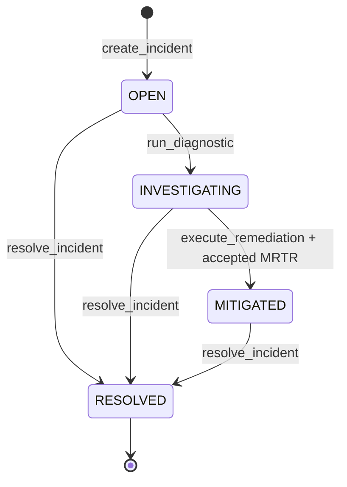
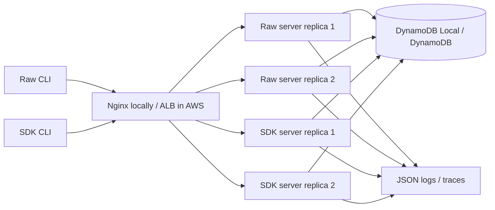
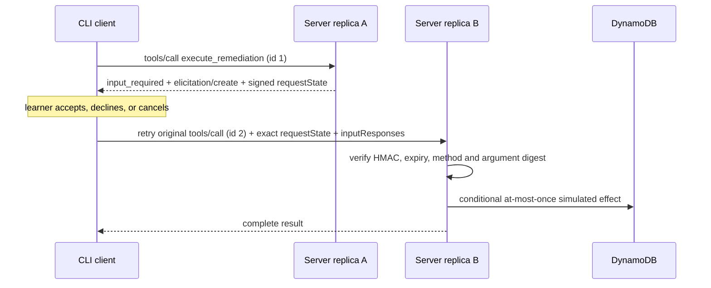

# PRD: Stateless MCP Incident Lab

## Overview

Stateless MCP Incident Lab is a hands-on TypeScript project for learning the Model Context Protocol revision `2026-07-28` by implementing the same simulated incident-response system twice: once directly over HTTP and JSON-RPC, and once with the official MCP SDK. Matching raw and SDK clients and servers must interoperate in all four combinations. The project proves the defining property of the revision—each request is self-contained and may reach any server replica—locally through Docker Compose and in AWS through an Application Load Balancer and horizontally scaled ECS Fargate services.

The lab is intentionally a simulator. It exposes fictional services, telemetry, runbooks, incidents, and remediation effects; it never reads or changes real infrastructure. The project is motivated by Simon Willison's observation that building a probing CLI is a productive way to learn a protocol and that constrained MCP capabilities are easier to audit than arbitrary shell and network access. The normative source is the MCP `2026-07-28` specification and TypeScript schema captured under [`sources/`](sources/README.md).

## Goals

1. Learn the stateless core at the wire level rather than only through SDK abstractions.
2. Compare raw and SDK implementations against one language-neutral contract.
3. Demonstrate that protocol statelessness does not prohibit explicit application state in DynamoDB.
4. Exercise discovery, tools, resources, prompts, caching hints, per-request capabilities, MRTR elicitation, request-scoped progress, cancellation, and protocol errors.
5. Prove interoperability and non-affinity across local and AWS deployments.
6. Produce a reusable CLI for inspecting and invoking `2026-07-28` MCP endpoints.

## User model

### Learner/operator

The sole user is a developer learning MCP. They can:

- start a deterministic local incident simulation;
- run either the raw or SDK CLI against either server;
- discover server versions and capabilities;
- list and inspect tools, resources, and prompts;
- open an incident and investigate fictional telemetry;
- run a streamed diagnostic and observe progress;
- approve, decline, or cancel a simulated disruptive remediation;
- inspect wire-level requests, response headers, cache decisions, replica IDs, and traces;
- deploy both server implementations to an ephemeral AWS environment, run the same acceptance matrix, and tear it down.

There is no administrator role, user account, or tenant boundary in the initial project.

## Domain and data model

### Entities

| Entity | Key fields | Purpose |
|---|---|---|
| `Service` | `service_id`, name, dependencies, region, health | Fictional production topology; seeded and stable |
| `TelemetryEvent` | `service_id`, timestamp, signal, severity, message, attributes | Deterministic logs and metrics used for diagnosis |
| `Runbook` | `service_id`, revision, markdown, updated_at | Context exposed as MCP resources |
| `Incident` | `incident_id`, title, severity, status, suspected_services, created_at, expires_at | Explicit application state carried between calls by opaque handle |
| `DiagnosticRun` | `diagnostic_id`, `incident_id`, status, findings | Records completed simulated diagnostics |
| `Remediation` | `remediation_id`, `incident_id`, action, target, status, effect, executed_at | Records a simulated action and enforces at-most-once execution |

DynamoDB uses a single-table design with `PK` and `SK`, conditional writes for lifecycle transitions and idempotency, and TTL for learner-created incidents. Static scenario data is seeded deterministically.

### Incident lifecycle



Invalid transitions return actionable tool execution errors rather than protocol errors. Unknown or expired handles return a recoverable error telling the caller to create another incident.

## Product topology



The endpoint paths distinguish implementations (`/raw/mcp` and `/sdk/mcp`); replicas behind each path are interchangeable. Every successful result includes the required `resultType` (`complete`, or `input_required` for an MRTR interim result) and `_meta.io.modelcontextprotocol/serverInfo`, plus a diagnostic replica identifier under a non-reserved vendor `_meta` prefix, so acceptance tests can prove distribution. JSON-RPC error responses have no result `_meta`; their replica identity is observable only in structured server logs. No protocol behavior may depend on that identifier.

## MCP surface

### Required request metadata

Every request carries its protocol metadata in the request `params._meta` object — never at the top level of the JSON-RPC message — and mirrors selected fields into HTTP headers:

- `params._meta.io.modelcontextprotocol/protocolVersion = "2026-07-28"` (required);
- `params._meta.io.modelcontextprotocol/clientCapabilities` (required);
- `params._meta.io.modelcontextprotocol/clientInfo` (recommended, not required; a negative test omits it and asserts the server still accepts the request);
- HTTP `MCP-Protocol-Version` matching the body;
- HTTP `Mcp-Method` matching the JSON-RPC method;
- HTTP `Mcp-Name` for `tools/call`, `resources/read`, and `prompts/get`;
- `Accept: application/json, text/event-stream`.

MRTR retry fields (`inputResponses`, `requestState`) are also request `params`, sibling to `name`/`arguments`, not tool arguments.

The client implements Base64 sentinel encoding for non-header-safe `Mcp-Name` and `Mcp-Param-*` values, omits an `Mcp-Param-*` header when the annotated argument is absent from the call or carries the value `null`, and excludes from its `tools/list` result any tool whose `x-mcp-header` annotation violates the specification's constraints. The server validates header/body equality case-insensitively for header names and case-sensitively for values, and never expects an `Mcp-Param-*` header for an argument the request body omits or carries as `null`.

### Discovery

`server/discover` returns:

- `supportedVersions: ["2026-07-28"]`;
- `tools`, `resources`, and `prompts` server capabilities, and no others. Because the lab implements neither list-change notifications, resource subscriptions, logging, nor argument completion, it never advertises `listChanged`, `subscribe`, `logging`, or `completions` — capabilities are declared only where the behavior exists, and both realizations advertise the identical set. Elicitation remains a client capability declared independently on each request;
- server identity and learner guidance;
- public cache hints.

Clients may invoke another RPC without discovery and recover from `UnsupportedProtocolVersionError` by selecting a mutually supported version.

### Tools

| Tool | Inputs | Output / behavior |
|---|---|---|
| `create_incident` | title, severity, suspected services | Creates an incident and returns opaque `incident_id` plus expiry |
| `get_incident` | `incident_id` | Returns current lifecycle state and related handles |
| `query_telemetry` | `incident_id`, service, signal, time range | Returns deterministic structured events; service is mirrored via `x-mcp-header` |
| `run_diagnostic` | `incident_id`, service | Streams monotonic progress and returns findings plus `diagnostic_id` |
| `propose_remediation` | `incident_id`, finding | Returns a safe simulated proposal and opaque `remediation_id` |
| `execute_remediation` | `incident_id`, `remediation_id` | Uses MRTR form elicitation; accepted retry executes once, decline/cancel has no effect |
| `resolve_incident` | `incident_id`, summary | Performs a valid terminal transition |

All tools have JSON Schema 2020-12 input and output schemas; validators never dereference a `$ref` that resolves to a network URI and enforce bounded schema depth and subschema count. Structured results are validated and duplicated as text for compatibility. Unknown tools and malformed protocol inputs use JSON-RPC `-32602` errors—never `-32601`, which is reserved for an unimplemented RPC method; domain failures use `isError: true` tool results.

### Resources

- `incident://topology/services` — stable fictional service map.
- `incident://runbooks/{service_id}` — versioned runbook markdown.
- `incident://incidents/{incident_id}/timeline` — incident-specific telemetry timeline.
- `resources/list`, `resources/templates/list`, and `resources/read` use deterministic ordering and pinned cache hints: `public` for the static topology and runbook resources, `private` for incident-scoped reads whose handle is a bearer token.
- Unknown resources return `-32602`; they never return an ambiguous empty `contents` array.

Every list operation (`tools/list`, `prompts/list`, `resources/list`, `resources/templates/list`) may be paginated. Page size is the server's choice, `nextCursor` is opaque to the client, the client follows cursors to completion without inferring meaning from their value, the cursor is part of the client cache key, and every page of one list carries the same `cacheScope` while each page may carry its own `ttlMs`. An invalid cursor returns `-32602`; a client whose cursor is rejected mid-walk discards every cached page of that list and re-walks from the first page rather than returning a partial list.

### Prompts

- `triage_incident(incident_id)` — user-controlled prompt containing investigation instructions and links to relevant resources.
- `review_remediation(incident_id, remediation_id)` — user-controlled prompt for reviewing evidence before execution.
- `prompts/list` is deterministic and cacheable; `prompts/get` validates required arguments and returns `-32602` for an unknown prompt name or a missing required argument.

### MRTR elicitation

The client declares `elicitation: { form: {} }` — the specification treats a bare `elicitation: {}` as form-mode-only support. `execute_remediation` requires form-mode elicitation, so a request that omits `elicitation` or declares only `url` support returns `-32021` rather than an elicitation the client cannot service; the server never emits an elicitation mode the request did not declare. Each elicitation carries `mode: "form"` and a human-readable `message`, and its `requestedSchema` is a flat object of primitive properties only, as form mode requires.

`execute_remediation` follows the stateless MRTR sequence:



The retry uses a new JSON-RPC ID and can land on another replica. `requestState` is opaque to the client, integrity-protected, expires after five minutes, and binds the original method and salient arguments. It affects only the retry of the request that produced it: the client never attaches it, or the matching `inputResponses`, to any other request it has in flight, and the server rejects it if it arrives on one. Because PLAN-001 deliberately has no authenticated user, it cannot satisfy elicitation's production identity-binding security requirement or bind `requestState` to an authenticated principal; this is a disclosed protocol-security exception deferred with authorization, not claimed as conforming behavior. The lab instead limits itself to one synthetic anonymous actor, enforces at-most-once execution with a conditional DynamoDB write, and keeps the endpoint synthetic, rate-limited, and ephemeral. Tampering, expiry, cross-request reuse, duplicate execution, missing capability, incomplete input, acceptance, decline, and cancel are all tested. An incomplete `inputResponses` object never executes remediation; the server returns another `input_required` result requesting the missing fields, and the client may repeat the stateless retry until the form is complete or cancelled.

### Progress and cancellation

`run_diagnostic` may return request-scoped SSE when the client supplies `params._meta.progressToken` — a string or integer, reserved by the specification as an unprefixed `_meta` key, and unique across the client's in-flight requests. Progress is monotonic, rate-limited, ends before the final response, and is never emitted after completion. Closing the HTTP response stream cancels work and releases resources. If a response stream breaks before its final response, the client treats that request as lost and reissues it with a new JSON-RPC ID. SSE responses set `X-Accel-Buffering: no`, and no proxy in the local or AWS path may buffer them. Simple requests may return `application/json`.

### Caching

Exactly six operations are cacheable and carry `ttlMs >= 0` and `cacheScope` on their `complete` results: `server/discover`, `tools/list`, `prompts/list`, `resources/list`, `resources/templates/list`, and `resources/read`. No other result — including every `tools/call` and `prompts/get` result — carries hints or may be cached. The client keeps only an in-process cache keyed by method and all result-affecting parameters, and never serves a result that arrived without hints. It never caches `input_required` results or MRTR retries, does not treat TTL as a polling interval, and can serve stale data only after a failed refresh with a visible warning. There is no Redis, shared cache, or queue.

### CLI surface

Both implementations expose equivalent commands:

```text
incident-mcp discover <url>
incident-mcp tools list <url>
incident-mcp tools inspect <url> <name>
incident-mcp tools call <url> <name> --json '<arguments>'
incident-mcp resources list <url>
incident-mcp resources read <url> <uri>
incident-mcp prompts list <url>
incident-mcp prompts get <url> <name> --json '<arguments>'
incident-mcp demo <url> [--approve|--decline|--cancel]
```

`--wire` prints redacted HTTP metadata and JSON-RPC messages; `--no-cache` bypasses the client cache. Commands return stable exit codes and machine-readable JSON by default, with diagnostics on stderr.

## Business rules

1. MCP transport context is never inferred from a connection, process, cookie, source IP, prior request, or replica.
2. Protocol version and client capabilities are evaluated independently on every request.
3. No response creates, returns, or relies on `Mcp-Session-Id`; GET or DELETE to an MCP endpoint returns HTTP 405, and `Last-Event-ID` is ignored.
4. Incident continuity uses only explicit opaque handles supplied in request arguments or an incident resource URI. Because the endpoint is unauthenticated, those handles are bearer tokens: they are high-entropy (UUIDv4 or stronger), unguessable, TTL-bounded, and redacted wherever request data is logged.
5. Tool, prompt, and resource lists are deterministic when their underlying sets are unchanged.
6. Every mirrored HTTP header must match its body source whenever that body field is present; mismatches, invalid header characters, and a missing `MCP-Protocol-Version`, `Mcp-Method`, or `Mcp-Name` return HTTP 400 and JSON-RPC `-32020`. That code carries only its specified meaning, so it is never returned for a missing or non-conforming `Accept`, which the client contract requires but the server does not reject.
7. Unsupported protocol versions return HTTP 400 and `-32022`, whose required `data.supported` lists the versions the server accepts and whose required `data.requested` echoes the rejected version.
8. Missing required client capability returns HTTP 400 and `-32021`, whose `data.requiredCapabilities` is a `ClientCapabilities` object—not an array of capability names—declaring the capabilities the request needed. Where captured specification prose instead says "missing capabilities", the captured `schema.ts` governs.
9. Missing methods return HTTP 404 and `-32601`; a request missing a required `params._meta` field returns HTTP 400 and `-32602` even when a mirrored header carries that value, so a missing body field is never reported as a header mismatch; other malformed requests use the applicable JSON-RPC standard code (`-32700`, `-32600`, or `-32602`). Every JSON-RPC error response whose HTTP status these rules do not pin elsewhere returns HTTP 400.
10. An invalid `Origin` returns HTTP 403. The 403 and 405 responses are transport-level rejections carrying no JSON-RPC body, so no error code is allocated for either; every 405 includes `Allow: POST`. Only the 413 and 504 responses carry an application-defined error envelope. Local servers bind to localhost unless running inside the isolated Compose network.
11. Remediation effects are fictional, reviewable, and conditionally written at most once.
12. A declined or cancelled elicitation never applies remediation.
13. Both raw and SDK realizations must produce equivalent observable behavior; implementation-specific metadata may differ only where explicitly allowed.
14. A request exceeding the configured body limit returns HTTP 413 with application-defined JSON-RPC error `-31999`; server work that exceeds its request deadline before any response stream has begun returns HTTP 504 with application-defined error `-31998`. Both codes are outside the reserved `-32768`–`-32000` range; implementations never emit an undefined `-32020`–`-32099` code. Both responses require `Content-Type: application/json`. Because this revision's request ID is a string or a number and a `null` ID is forbidden, any error response whose originating ID could not be read, or was read but is not a valid request ID — including the 413 case (size enforcement counts and discards bytes without parsing a partial body), unparseable bodies, and a request whose `id` is absent, `null`, or non-scalar — omits the `id` member entirely; every other error response, including the 504, echoes the originating request `id`. Neither response includes result `_meta` nor leaves a partial tool effect. When a deadline is exceeded after an SSE response stream has already begun, the server closes the stream as the cancellation signal and the client reissues under the lost-stream rule above.
15. Each POST body is exactly one JSON-RPC request or notification: batch arrays and client-sent JSON-RPC responses are rejected as malformed shapes with `-32600`. A notification POST returns HTTP 202 with no body and no side effect, evaluated immediately after the malformed-shape step below and bypassing the metadata, header, version, and capability checks, because this revision defines no header requirements for notification POSTs and no client-to-server notification methods.
16. Overlapping request failures use this precedence: invalid `Origin` → unsupported HTTP method → body too large → malformed JSON/JSON-RPC shape → missing required `params._meta` fields → mirrored header/body mismatch or missing/malformed mirrored header → unsupported protocol version → missing required capability → unknown JSON-RPC method → domain validation. The response deadline applies only after those synchronous checks. This preserves the rule that a missing body metadata field is never misreported as a header mismatch.

## Interoperability and acceptance

The mandatory matrix is:

| Client | Server | Required |
|---|---|---|
| Raw | Raw | Yes |
| Raw | SDK | Yes |
| SDK | Raw | Yes |
| SDK | SDK | Yes |

Each pair runs discovery, catalog reads, resource/prompt retrieval, an incident workflow, MRTR acceptance/decline/cancel, error recovery, cache behavior, SSE progress/cancellation, and structured output validation. The local deployment proves cross-replica MRTR deterministically by sending the initial call and retry to test-only direct replica endpoints, while separately proving the public Nginx endpoint distributes requests. AWS proves ALB distribution across at least two task IDs, then runs up to 20 serialized initial/retry pairs and requires at least one pair to complete on different task IDs; this bounded observation fails rather than making an unverified cross-replica claim.

## Non-functional requirements

| Area | Target |
|---|---|
| Correctness | All selected wire-level MCP normative requirements and all four interoperability combinations pass; the unauthenticated elicitation identity-binding exception is explicitly excluded from the conformance claim |
| Statelessness | At least 100 sequential requests distribute across at least two healthy replicas; behavior and result equivalence do not depend on replica |
| Reliability | Zero duplicate simulated remediation effects under 20 concurrent retries of one accepted MRTR state |
| Performance | After warm-up, catalog requests at 10 requests/s achieve p95 ≤ 750 ms and error rate < 1% locally and in AWS |
| Security | Origin validation, schema validation, header/body validation, requestState integrity/expiry, dependency audit with no unsuppressed high/critical findings, no real remediation |
| Observability | Trace context propagates in `_meta` under the specification's unprefixed `traceparent`/`tracestate` keys in W3C Trace Context format; structured JSON logs include method, name (redacted when it contains a bearer handle), request ID, replica, latency, result type, and trace ID; no log contains an unredacted incident handle, requestState, or elicitation content |
| Portability | Node.js 24 LTS; local workflow runs on Docker Compose; cloud stack targets `ap-southeast-1` by default |
| Test quality | 100% statement and branch coverage for protocol codecs/validators; mutation score ≥ 90% for raw protocol core |
| Cost/lifecycle | AWS environment is ephemeral and `cdk destroy` is part of acceptance; actual cost is measured and disclosed rather than guaranteed |

## Deployment

### Local

The acceptance matrix uses one `demo/matrix.compose.yaml` command to run DynamoDB Local, a deterministic seed job, Nginx, two raw-server replicas, and two SDK-server replicas; it also exposes test-only direct replica endpoints on localhost for deterministic cross-replica scenarios. Health checks gate readiness through non-MCP endpoints `GET /raw/healthz` and `GET /sdk/healthz`; they require no MCP headers, return `200` with `Content-Type: application/json` and `{"status":"ok"}` only after the server and DynamoDB adapter are ready, and otherwise return `503` with `{"status":"unavailable"}`. Each implementation registry manifest points to a smaller per-implementation Compose file for authoring and implementation review before its sibling exists; those stacks are independent and do not claim to run the four-way matrix. The same images and environment contracts are used in CI.

### AWS

AWS CDK provisions:

- one DynamoDB table with on-demand capacity, encryption, point-in-time recovery disabled for the ephemeral lab, and TTL;
- ECR repositories for immutable raw and SDK images;
- an ECS Fargate service per server realization, each with at least two tasks;
- an internet-facing ALB routing `/raw/mcp` and `/sdk/mcp` to separate target groups;
- AWS WAF rate-based protection, strict security groups, and a mandatory HTTPS listener using a temporary certificate/domain; deployment hard-stops rather than exposing a public plaintext listener when those prerequisites are unavailable;
- Secrets Manager material for MRTR state integrity;
- CloudWatch logs and metrics;
- required project/environment/owner tags.

The deployment uses the authenticated `cc-sandbox` profile interactively. Credentials are never committed. Cloud apply and teardown remain separately gated actions.

## Security posture

The initial endpoint is unauthenticated to keep the project focused on the stateless core. It contains only synthetic shared data and simulated effects. The cloud environment is deployed only for acceptance and torn down immediately afterward. WAF rate limiting, bounded request sizes, timeouts, least-privilege IAM, origin validation, schema complexity bounds, safe header encoding, output sanitization, and dependency scanning remain required. For `resources/read`, the required `Mcp-Name` mirror carries the incident resource URI—and therefore its bearer handle—through Nginx and the ALB. TLS is mandatory for public transit, and Nginx, ALB/WAF access, and application logging configurations must omit or redact the mirrored header and corresponding body field.

This is a deliberate learning boundary, not a claim that unauthenticated remote MCP is production-ready or fully conforms to elicitation's identity-binding security requirement. OAuth issuer validation, Client ID Metadata Documents, authorization-context cache isolation, authenticated-principal binding, and user-bound handles belong in a later plan.

## Out of scope

- MCP authorization, OAuth, CIMD, DCR, user identity, roles, and tenancy.
- Tasks, MCP Apps, Skills over MCP, Enterprise Managed Authorization, or other extensions.
- Legacy initialization/session behavior, dual-era compatibility, HTTP+SSE, resumable streams, Roots, Sampling, and Logging.
- `subscriptions/listen`, list-change notifications, and resource subscriptions.
- `completion/complete` argument autocompletion and the `completions` server capability.
- URL-mode elicitation or handling secrets through elicitation.
- Real logs, credentials, cloud APIs, shell execution, service restarts, host isolation, or production remediation.
- A graphical frontend or LLM/chat-host integration.
- Multi-region failover, production uptime, permanent public hosting, or a production authorization posture.
- External shared caches and queues.

## Decision boundaries

### Later phases may decide autonomously

- Internal class/function names and file layout within the approved hexagonal boundaries.
- Exact fictional service names, telemetry messages, runbook prose, and seeded incident values.
- CLI presentation details that preserve JSON output and stable exit codes.
- Cache TTL values within documented safe bounds.
- CDK construct decomposition and test fixture organization.
- Dependency patch versions compatible with Node.js 24 and MCP `2026-07-28`.

### Must return to the user

- Adding real infrastructure access or any non-simulated mutating capability.
- Making the AWS deployment persistent or production-facing.
- Adding authentication, identity, paid third-party services, or another cloud.
- Adding an MCP extension, legacy compatibility, GUI, or LLM provider integration.
- Introducing shared implementation logic or a shared package between the raw and SDK realizations.
- Weakening the four-way interoperability matrix, statelessness proof, security controls, or teardown requirement.

## Sources

See [`sources/README.md`](sources/README.md) for captured URLs, authority, scope, and hashes. In priority order:

1. MCP `2026-07-28` specification and `schema.ts` — normative.
2. MCP release announcement — release rationale and migration summary.
3. Simon Willison's stateless MCP article — project-learning motivation and CLI prior art.
4. `mcp-explorer` README — requirements input for a usable explorer CLI, not an architecture blueprint.
